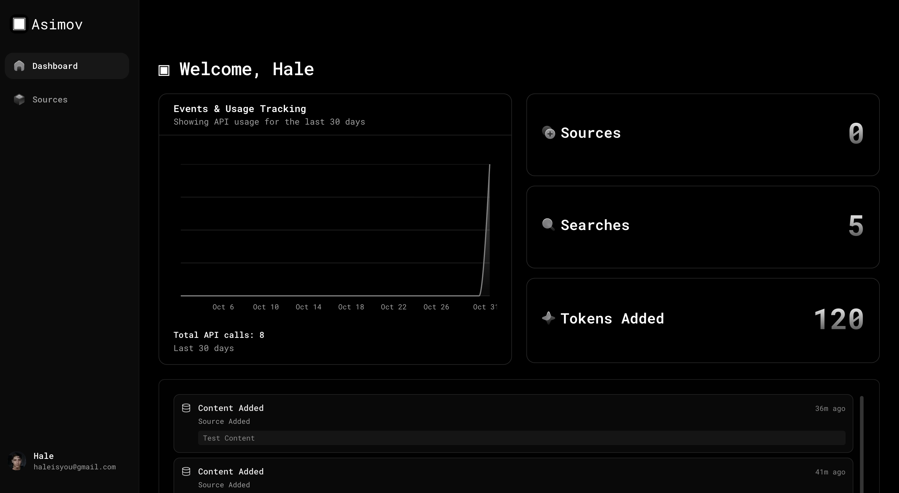

## Setting up

Quickly learn to use Asimov with your agent.

<Card
  title="Start here"
  icon="compass"
  href="/quickstart"
  horizontal
>
  See how to install the MCP and Integrate it with your coding assistant.
</Card>

## See also

Learn about how to use tools effectively with coding agents.

<Columns cols={1}>
  <Card
    title="MCP Intergation"
    icon="plug"
    href="/integrations/mcp-integration"
  >
    Connect Asimov's tools with Cursor, Claude Code, Codex Windsurf and more.
  </Card>
  <Card
    title="Tools"
    icon="cubes"
    href="/essentials/settings"
  >
    Customize the design and colors of your site to match your brand.

  </Card>
  <Card
    title="Support"
    icon="circle-question"
    href="/faq"
  >
    Auto-generate API documentation from OpenAPI specifications.
  </Card>
</Columns>

