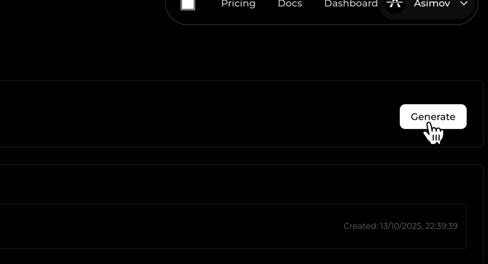

### Get started in three steps

1. Get API_KEY > 2. Connect MCP > 3. Use Tool


### Step 1: Create your API Key 


1. Go to https://asimov.mov/settings/api
2. Click "Generate" button
3. Copy the Generated API Key

### Step 2: Connect MCP Server

Choose your preferred AI coding assistant and follow the configuration steps:

<Tabs>
  <Tab title="Claude Code">
    Add the following configuration to your `~/.config/claude/claude_desktop_config.json`:

    ```json
    {
      "mcpServers": {
        "asimov": {
          "command": "npx",
          "args": ["-y", "asimov-mcp"],
          "env": {
            "API_KEY": "your-api-key-here",
            "API_URL": "https://asimov.mov" 
          }
        }
      }
    }
    ```

    Replace `your-api-key-here` with the API key you generated in Step 1.
  </Tab>

  <Tab title="Cursor">
    Add the following configuration to your Cursor MCP settings file:

    **macOS/Linux:** `~/.cursor/mcp.json`
    **Windows:** `%APPDATA%\Cursor\mcp.json`

    ```json
    {
      "mcpServers": {
        "asimov": {
          "command": "npx",
          "args": ["-y", "asimov-mcp"],
          "env": {
            "API_KEY": "your-api-key-here",
            "API_URL": "https://asimov.mov" 
          }
        }
      }
    }
    ```

    Replace `your-api-key-here` with the API key you generated in Step 1.
  </Tab>

  <Tab title="Windsurf">
    Add the following configuration to your Windsurf MCP settings:

    **macOS:** `~/Library/Application Support/Windsurf/mcp.json`
    **Linux:** `~/.config/Windsurf/mcp.json`
    **Windows:** `%APPDATA%\Windsurf\mcp.json`

    ```json
    {
      "mcpServers": {
        "asimov": {
          "command": "npx",
          "args": ["-y", "asimov-mcp"],
          "env": {
            "API_KEY": "your-api-key-here",
            "API_URL": "https://asimov.mov"
          }
        }
      }
    }
    ```

    Replace `your-api-key-here` with the API key you generated in Step 1.
  </Tab>

  <Tab title="Codex">
    Add the following configuration to your Codex config file:

    **macOS/Linux:** `~/.codex/config.toml`
    **Windows:** `%USERPROFILE%\.codex\config.toml`

    ```toml
    [mcp_servers.asimov]
    command = "npx"
    args = ["-y", "asimov-mcp"]
    env = { "API_KEY" = "your-api-key-here", "API_URL" = "https://asimov.mov" }
    ```

    Replace `your-api-key-here` with the API key you generated in Step 1.
  </Tab>
</Tabs>

<Note>
  After adding the configuration, restart your AI coding assistant to load the MCP server.
</Note>

### Step 3: Use Asimov MCP Tools

Once you've configured the MCP server and restarted your AI coding assistant, you can start using Asimov's tools:

1. **Access the tools**: The Asimov MCP tools will be automatically available in your assistant's interface
2. **Available tools**: You'll have access to tools for:
   - Context Retrieval
   - Repository Map
   - Web Search
   - And more...

3. **Example usage**: Simply ask your assistant to use Asimov tools:
   ```
   "Use Asimov to give the file strcture of socketio github repo"
   "Save the above conversation in your context."
   ```

<Note>
  The assistant will automatically detect and use the appropriate Asimov MCP tools based on your requests.
</Note>

